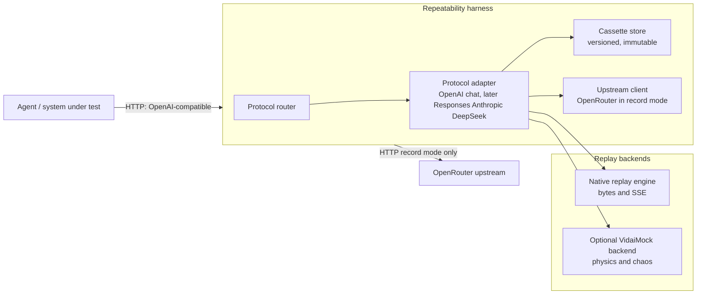

# Repeatability harness for VidaiMock

## Context and problem statement

End-to-end (E2E) tests that exercise agent flows against real Large Language
Model (LLM) APIs routinely fail repeatability requirements. Even with
“deterministic” settings, upstream providers can vary outputs due to routing,
capacity, and implementation detail. OpenRouter explicitly supports
model/provider normalization and fallbacks, and supports streaming over
Server-Sent Events (SSE), including comment payloads and mid-stream error
signalling. citeturn2search0turn2search1turn2search10

The required capability is a harness that captures a complete agent↔LLM session
once (recording against OpenRouter, free or paid models), then replays it as
part of a regression suite with strong repeatability guarantees and failure
diagnostics. The harness must:

- Expose an OpenAI Chat Completions-compatible HTTP endpoint first
  (`/v1/chat/completions` semantics). citeturn7search1
- Extend to OpenAI Responses, Anthropic-compatible Messages streaming, and
  DeepSeek-compatible APIs over time.
  citeturn7search0turn3search10turn3search0
- Provide a Rust library API and a CLI.
- Load configuration via OrthoConfig’s layered precedence model (CLI > env >
  config files > defaults), including subcommand configuration merging.
  citeturn4search1turn4search9turn4search3
- Integrate with VidaiMock for replay realism where it improves test coverage
  (latency/TTFT/jitter, chaos primitives), while keeping an early shippable
  vertical slice that does not depend on undocumented VidaiMock fixture
  formats. VidaiMock advertises OpenAI- and Anthropic-compatible endpoints,
  streaming simulation, and chaos injection via headers, and that it runs fully
  offline/stateless. citeturn2search7

WireMock (or equivalent) can record/play back HTTP interactions by proxying and
producing stub mappings, but the harness should only rely on this class of tool
if VidaiMock or the harness itself cannot provide recording that is fit for LLM
SSE and multi-protocol evolution. citeturn0search0turn0search1

## Goals and non-goals

### Goals

- Capture and replay LLM API interactions with deterministic matching and
  diagnostics.
- Support streaming capture and replay for OpenRouter/OpenAI-style SSE
  (including comment payloads), because agents frequently stream partial
  output. OpenRouter documents SSE streaming and its comment payloads.
  citeturn2search1turn2search0
- Provide two operational modes:
  - **Record**: proxy upstream (OpenRouter) and persist a “cassette”.
  - **Replay**: serve deterministic responses from the cassette, without
    external network.
- Make configuration auditable and reproducible using OrthoConfig:
  - Use `OrthoConfig::load()` precedence rules.
  - Use subcommand config merges for `record`, `replay`, `export`, `verify`.
    citeturn4search1turn4search9
- Enable progressive enhancement:
  - Initial endpoint: OpenAI Chat Completions-compatible.
  - Later: OpenAI Responses streaming events, Anthropic Messages
    (`/v1/messages`) streaming, and DeepSeek (OpenAI-compatible).
    citeturn7search0turn3search10turn3search0
- Provide a stable on-disk format for recorded sessions with explicit
  versioning and forward-compatibility.

### Non-goals

- Attempt to “make the model deterministic” during recording (temperature
  forcing, seed injection) across all vendors. The harness captures reality and
  replays it.
- Mock external tool/service calls beyond the LLM API boundary. Those belong to
  separate fixtures/mocks.
- Require VidaiMock internals/fixture schemas in the first deployable slice;
  VidaiMock integration should be additive.

## Architecture overview

The harness is an HTTP server plus a cassette store, with a protocol adapter
layer. In record mode it proxies to OpenRouter’s OpenAI-compatible API base
(`/api/v1/chat/completions`) and records the full request/response exchange.
OpenRouter documents its OpenAI-like request/response schema and that streaming
is SSE with occasional comment payloads. citeturn2search0turn2search1

The same server runs in replay mode and answers from the cassette. VidaiMock
can be used as an optional replay backend to simulate TTFT/jitter and chaos
failure modes that it explicitly advertises. citeturn2search7

A short diagram description follows. The diagram shows the record/replay data
flow and the adapter boundary.



Key architectural points:

- **Protocol router** mounts HTTP routes for supported APIs:
  - Initial: `POST /v1/chat/completions` (OpenAI Chat Completions-compatible).
    citeturn7search1
  - Later: `POST /v1/responses` (OpenAI Responses API). citeturn7search0
  - Later: `POST /v1/messages` (Anthropic Messages) with SSE event types.
    citeturn3search10
  - Later: DeepSeek Chat Completions (OpenAI-compatible). citeturn3search0
- **Protocol adapter** provides:
  - Request canonicalization and matching keys.
  - Streaming parsers/emitters appropriate to each protocol.
- **Cassette store**:
  - Append-only in record mode.
  - Read-only in replay mode.
  - Supports strict sequential replay and keyed replay modes.
- **Upstream client**:
  - Targets OpenRouter’s base URL and endpoints.
  - Adds OpenRouter optional attribution headers if configured (`HTTP-Referer`,
    `X-Title`). citeturn2search2turn0search3
- **Replay backend selection**:
  - Native replay: earliest slice, no external dependency.
  - VidaiMock replay: optional enhancement to simulate streaming physics and
    chaos (because VidaiMock advertises both). citeturn2search7

## Recording and replay semantics

### Cassette definition

A cassette is a single recorded agent session, consisting of an ordered list of
interactions. Each interaction contains:

- Request:
  - Method, path, query.
  - Selected headers (excluding secrets).
  - Body bytes and parsed JSON (when applicable).
  - Canonical request representation and a stable hash.
- Response:
  - Status, selected headers.
  - Either:
    - Non-stream response body bytes, or
    - A stream transcript (SSE events as parsed units + optional timing).
- Metadata:
  - Protocol identifier (e.g., `openai.chat_completions.v1`).
  - Upstream identifier (`openrouter`).
  - Timestamps (recorded and relative offsets).

### Matching modes

Two matching modes enable early delivery while covering common regression-suite
needs:

- **Sequential strict mode (default)**:
  - Replay expects the next incoming request to match the next recorded
    interaction.
  - Any mismatch fails fast with a diagnostic response (409) containing:
    - Expected interaction ID.
    - Observed request hash.
    - A diff summary of canonical request JSON (field-level).
  - This mode maximizes repeatability and debugging speed for deterministic,
    single-threaded agent loops.

- **Keyed mode (optional)**:
  - Replay matches by request hash and consumes the next unused interaction
    with that hash.
  - Supports limited reordering and concurrent requests, at the cost of less
    precise failure locations.

### Canonicalization and hashing

Canonicalization normalizes inputs so that stable matching does not depend on:

- JSON key ordering.
- Insignificant whitespace.
- Runtime-generated metadata fields, when configured to ignore them.

The canonicalization pipeline should be explicit and configurable per protocol
adapter. For OpenAI Chat Completions, the request body schema includes fields
like `stream` and `stream_options`, which materially affect response shape, so
those fields must participate in the canonical form. citeturn7search1

Recommended approach:

- Parse JSON into a `serde_json::Value`.
- Apply a protocol-specific “normalization pass”:
  - Drop configured paths (example: `metadata.run_id`).
  - Optionally coerce numeric types (avoid `1` vs `1.0` drift).
- Serialize with a canonical serializer (sorted object keys, stable float
  formatting).
- Hash (SHA-256) over: `method + path + canonical_json`.

### Streaming capture and replay

#### OpenRouter / OpenAI Chat Completions streaming

OpenRouter supports SSE streaming for Chat Completions; its documentation notes
that comment payloads may be sent (e.g., `: OPENROUTER PROCESSING`) and should
be ignored per SSE rules. citeturn2search1

OpenAI’s Chat Completions API streams “chat completion chunk” objects via SSE
when `stream: true`, and supports `stream_options.include_usage` producing an
additional final chunk with usage. citeturn7search1

Recording strategy for OpenAI-style SSE:

- Implement a streaming proxy:
  - Read upstream bytes incrementally.
  - Parse SSE frames into event records:
    - `comment` frames (leading `:`) recorded as `comment` type.
    - `data:` frames captured as raw string and, when JSON, parsed into `Value`.
  - Forward frames to the downstream client as bytes *without re-chunking*
    where possible (preserves client edge cases).
- Store both:
  - The parsed event list (for deterministic replay), and
  - The raw byte transcript (for fidelity/debugging).

Replay strategy:

- Emit SSE frames from the recorded transcript.
- Provide a configuration flag to apply “physics” timing:
  - TTFT delay before first token.
  - Inter-chunk spacing (fixed or recorded).
- When VidaiMock is used as a replay backend, prefer VidaiMock’s existing
  streaming physics/chaos semantics where feasible, because those behaviours
  are explicitly a VidaiMock feature. citeturn2search7

#### Anthropic Messages streaming

Anthropic streaming uses SSE with explicit `event:` names and a defined event
flow (`message_start`, content block events, `message_delta`, `message_stop`),
and may include `ping` and `error` events. citeturn3search10

Adapter implications:

- SSE parser must support `event:` and `data:` framing.
- Recorder must store event names and JSON payload.
- Replayer must preserve event ordering and allow unknown event types to pass
  through unchanged, because Anthropic may add new event types.

#### OpenAI Responses streaming

OpenAI Responses streaming emits a set of typed events such as
`response.created`, `response.output_text.delta`, `response.completed`, and
`error`. citeturn7search0turn7search4

Adapter implications:

- Recorder should store the event `type` field and sequence ordering.
- Replayer should preserve:
  - Event ordering,
  - Event payload content exactly,
  - The final “completed/failed/incomplete” event semantics.

#### DeepSeek compatibility

DeepSeek documents that its API format is compatible with OpenAI, and that
clients can use `https://api.deepseek.com/v1` as an OpenAI-compatible base URL.
citeturn3search0

Compatibility implications:

- The “DeepSeek adapter” may be a thin configuration preset over the OpenAI
  Chat Completions adapter.
- Recording against DeepSeek in future should only require:
  - Upstream base URL and API key,
  - Potentially model name mapping.

### VidaiMock and recording tooling

VidaiMock’s public product description emphasises offline mocking,
provider-compatible endpoints, streaming physics, and chaos injection via
headers, but does not describe an HTTP recording feature. citeturn2search7

Therefore, the early design assumes recording must be implemented by the
harness itself. WireMock is a proven recording/proxy tool (record/snapshot via
proxying), but it introduces a JVM runtime and produces generic HTTP stub
mappings, which are typically insufficient for protocol-aware SSE replay and
multi-protocol evolution without additional transformation.
citeturn0search0turn0search1

A practical compromise:

- Implement native recording/replay in Rust as the primary path.
- Provide an optional “WireMock export” later if compatibility with existing
  teams/tooling is needed.

## Rust API and module boundaries

### Crate layout

- `vidaimock_harness` (library)
  - `config`: configuration structs and OrthoConfig integration
  - `protocol`: protocol adapter traits and implementations
  - `cassette`: cassette schema, canonicalization, hashing, store trait
  - `server`: HTTP server wiring (Axum/Hyper)
  - `upstream`: OpenRouter/OpenAI/Anthropic/DeepSeek clients
  - `replay`: native replay engine; optional VidaiMock backend driver
- `vidaimock-harness` (binary)
  - CLI definitions (Clap)
  - Delegates to library

### Configuration via OrthoConfig

OrthoConfig provides a `load()` method that loads configuration using
precedence rules where command-line arguments have the highest precedence,
environment variables next, then configuration files, with default attribute
values at the lowest. citeturn4search1

OrthoConfig also supports subcommand configuration merging
(`load_and_merge_subcommand_for` / `SubcmdConfigMerge`) that reads per-command
defaults from configuration under a `cmds` namespace and merges them beneath
CLI args. citeturn4search9

File format support notes:

- TOML parsing is enabled by default, and JSON5/YAML can be enabled by feature
  flags. citeturn4search3

### Core traits and types

```rust,no_run
use serde::{Deserialize, Serialize};
use std::path::PathBuf;

#[derive(Debug, Clone, Deserialize)]
pub struct HarnessConfig {
    pub listen: ListenAddr,
    pub mode: Mode,

    pub protocol: Protocol,         // openai_chat_completions initially
    pub match_mode: MatchMode,      // sequential_strict default
    pub cassette_dir: PathBuf,
    pub cassette_name: String,

    pub upstream: Option<UpstreamConfig>, // required for record mode
    pub redaction: RedactionConfig,

    pub replay: ReplayConfig,       // timing, strictness, vv
}

#[derive(Debug, Clone, Deserialize)]
pub struct UpstreamConfig {
    pub kind: UpstreamKind,         // openrouter initially
    pub base_url: String,           // e.g. https://openrouter.ai/api/v1
    pub api_key_env: String,        // env var name, not the key itself
    pub extra_headers: Vec<(String, String)>, // HTTP-Referer, X-Title, etc.
}

#[derive(Debug, Clone, Copy, Deserialize)]
pub enum Mode { Record, Replay }

pub trait ProtocolAdapter: Send + Sync {
    fn protocol_id(&self) -> &'static str;

    fn canonical_request(&self, req: &HttpRequest) -> CanonicalRequest;
    fn parse_stream(&self, bytes: &[u8]) -> Vec<StreamEvent>; // protocol-specific

    fn build_response(&self, interaction: &Interaction) -> HttpResponse;
    fn build_stream(&self, interaction: &Interaction) -> StreamEmitter;
}
```

### Public library API surface

The library API should allow both:

- CLI-driven execution, and
- Test harness embedding (spawn server on ephemeral port, run scenario, extract
  diagnostics).

```rust,no_run
use std::net::SocketAddr;

pub struct RunningHarness {
    pub addr: SocketAddr,
    pub cassette_path: std::path::PathBuf,
}

impl RunningHarness {
    pub async fn shutdown(self) -> anyhow::Result<()>;
}

pub async fn start_harness(cfg: HarnessConfig) -> anyhow::Result<RunningHarness>;
```

Recommended additions for regression suite integration:

- `CassetteVerifier`:
  - Verifies cassette format version.
  - Verifies no secrets leaked (headers scrubbed).
  - Verifies sequential integrity.
- `MismatchReport`:
  - Structured diff output for CI annotations.

## CLI integration and configuration

### CLI shape

Subcommands map directly to vertical-slice deliverables:

- `record`: run proxy server, write cassette
- `replay`: run replay server from cassette
- `verify`: validate cassette integrity and redaction
- `export vidaimock`: generate VidaiMock-compatible fixtures (introduced once
  VidaiMock schema is confirmed)
- `export wiremock`: optional later

Subcommand-specific config merging should be enabled via OrthoConfig to support
per-command defaults in config files. citeturn4search9

### Example CLI usage

```bash
# Record a session by running a local OpenAI-compatible endpoint.
vidaimock-harness record \
  --listen 127.0.0.1:8787 \
  --cassette-name podbot_smoke_001 \
  --upstream.kind openrouter \
  --upstream.base-url https://openrouter.ai/api/v1 \
  --upstream.api-key-env OPENROUTER_API_KEY
```

```bash
# Replay the recorded session without network access.
vidaimock-harness replay \
  --listen 127.0.0.1:8787 \
  --cassette-name podbot_smoke_001
```

### Example configuration file

TOML is the default supported file format for OrthoConfig.
citeturn4search3turn4search1

```toml
listen = "127.0.0.1:8787"
mode = "replay"
protocol = "openai_chat_completions"
match_mode = "sequential_strict"

cassette_dir = "fixtures/llm"
cassette_name = "podbot_smoke_001"

[redaction]
drop_headers = ["authorization", "x-api-key"]

[replay]
simulate_timing = true
ttft_ms = 20
tps = 200

[cmds.record.upstream]
kind = "openrouter"
base_url = "https://openrouter.ai/api/v1"
api_key_env = "OPENROUTER_API_KEY"

# Optional OpenRouter attribution headers.
# OpenRouter documents HTTP-Referer and X-Title as optional. citeturn2search2turn0search3
[cmds.record.upstream.extra_headers]
http_referer = "https://example.invalid"
x_title = "CI Regression Harness"
```

## Testing, observability, and rollout roadmap

### Test strategy

- Unit tests:
  - Canonicalization stability (JSON key order, whitespace).
  - Hash stability for known request fixtures.
  - SSE parser correctness for:
    - OpenAI-style `data:` frames and end markers.
    - OpenRouter comment frames (leading `:`). citeturn2search1turn7search1
    - Anthropic `event:` + `data:` frames and event flow ordering.
      citeturn3search10
- Integration tests:
  - Full record→replay cycle with a stub upstream server (no real OpenRouter
    calls).
  - Mismatch diagnostics content and exit codes.
- Contract tests:
  - Ensure response shapes remain OpenAI-compatible for Chat Completions.
    citeturn7search1

### Observability

VidaiMock advertises built-in Prometheus metrics and request tracing for
simulation runs. citeturn2search7

The harness should provide, at minimum:

- Structured logs:
  - Interaction index/ID.
  - Record/replay mode.
  - Upstream latency and stream duration (record mode).
  - Mismatches (expected vs observed hashes).
- Metrics (Prometheus optional):
  - `harness_requests_total{mode,protocol}`
  - `harness_mismatches_total{protocol}`
  - `harness_recorded_interactions_total{cassette}`
  - `harness_replayed_interactions_total{cassette}`

### Roadmap tasks

The following tasks focus on early, deployable slices and measurable outcomes,
avoiding time commitments.

#### 1.1. OpenAI Chat Completions record and replay

- [ ] 1.1.1. Implement HTTP server for `POST /v1/chat/completions` (non-stream).
  - [ ] Return recorded JSON response bytes verbatim during replay.
  - [ ] Store cassette as `cassette.json` with `format_version` and ordered
        interactions.
  - [ ] Add strict sequential matching with request hash and diff summary on
        mismatch.
- [ ] 1.1.2. Add streaming proxy/recorder for OpenAI-style SSE.
  - [ ] Parse and record `data:` frames and preserve raw transcript.
  - [ ] Replay recorded SSE frames deterministically.
- [ ] 1.1.3. Add OpenRouter streaming comment handling.
  - [ ] Ignore comment frames for canonical replay matching.
  - [ ] Optionally emit recorded comment frames during replay to preserve
        realism. citeturn2search1

#### 1.2. Configuration and ergonomics

- [ ] 1.2.1. Integrate OrthoConfig `load()` into both library and CLI with
      documented precedence.
  - [ ] CLI overrides env and config file values by construction.
        citeturn4search1
- [ ] 1.2.2. Implement subcommand config merging (`cmds` namespace).
  - [ ] `cmds.record.*` defaults merged beneath CLI flags for record mode.
        citeturn4search9
- [ ] 1.2.3. Add `verify` subcommand.
  - [ ] Validate cassette version, ordering, and that redaction rules removed
        secrets.

#### 1.3. VidaiMock integration for replay realism

- [ ] 1.3.1. Implement “native physics” replay controls (TTFT/TPS/jitter).
  - [ ] Provide deterministic timing presets for CI and “realistic” presets for
        resilience tests.
- [ ] 1.3.2. Add optional VidaiMock backend driver.
  - [ ] Start VidaiMock as a subprocess and configure chaos/physics via
        supported mechanisms (headers/env/config), using VidaiMock’s advertised
        primitives. citeturn2search7
  - [ ] Export deterministic fixtures into the VidaiMock format once the schema
        is confirmed.

#### 1.4. Multi-protocol support

- [ ] 1.4.1. Add OpenAI Responses endpoint support (`POST /v1/responses`).
  - [ ] Record and replay typed streaming events (`response.created`,
        `response.output_text.delta`, `response.completed`, `error`).
        citeturn7search0turn7search4
- [ ] 1.4.2. Add Anthropic Messages endpoint support (`POST /v1/messages`).
  - [ ] Record and replay SSE with `event:` names and content block events.
        citeturn3search10
- [ ] 1.4.3. Add DeepSeek compatibility presets.
  - [ ] Support base URL presets (`https://api.deepseek.com/v1`) and model IDs
        as configuration. citeturn3search0

## Known risks and limitations

- **Private VidaiMock fixture schema uncertainty**: VidaiMock advertises
  powerful simulation features and provider compatibility but its public
  description does not specify a recording feature or an on-disk fixture
  schema. citeturn2search7 Mitigation: ship with native recording/replay
  first; add VidaiMock export/backend once the schema is confirmed from
  authoritative documentation.
- **Streaming fidelity edge cases**: SSE proxying can break clients if frame
  boundaries or headers differ. OpenRouter’s comment frames and mid-stream
  error reporting increase edge cases. citeturn2search1turn2search10
  Mitigation: record raw byte transcript and replay it verbatim as an option;
  test against representative SSE clients.
- **Request drift due to metadata**: Agents may include run IDs or timestamps
  in `metadata`, breaking strict matching. Mitigation: configurable
  normalization rules with explicit ignored JSON paths and clear mismatch
  diagnostics showing ignored vs compared fields.
- **Concurrency in agents**: Parallel LLM calls can defeat sequential strict
  mode. Mitigation: keyed matching mode and per-request “interaction group”
  tags; document limitations and recommend deterministic single-threaded test
  profiles for core regressions.
- **WireMock dependency pressure**: WireMock record/playback works well for
  generic HTTP but is not tailored for LLM streaming protocols, and adds
  operational complexity. citeturn0search0turn0search1 Mitigation: keep
  WireMock integration optional and export-only; avoid requiring it for
  baseline harness operation.
